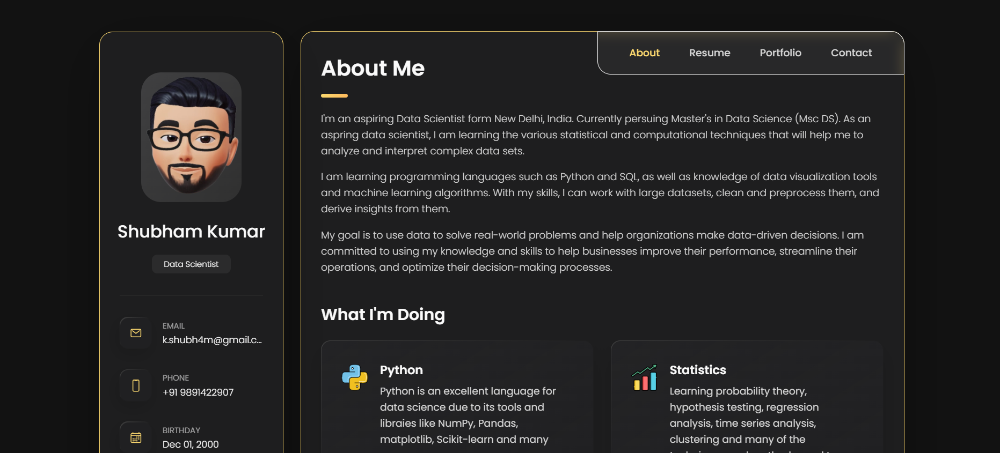
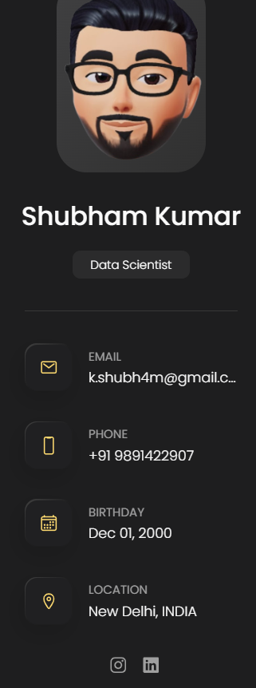
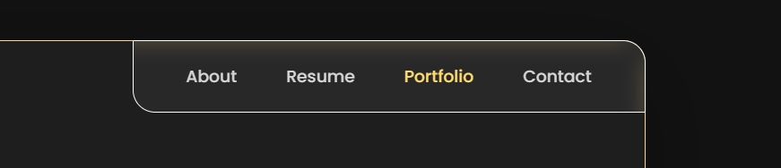
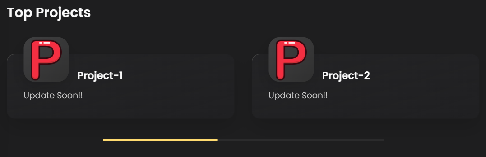

# My portfolio 

Name: Shubham Kumar      
Email: shubham.kumar@msds.christuniversity.in 
Phone Number: 9891422907 

This is a project based learning path for my web development roadmap.

## Table of Contents
<h3>1. Side Bar</h3>

<h3>2. Nav Bar</h3>

<h3>3. Top Project</h3>

## Project Description

I used this project for my self learning. It played an important role in my web-development learning phase. I have made few changes based on my preference and may add few more features later in my learning phase.

## Website

Check out the live website [here](https://shubh4mk.github.io/MyPortfolio/).
